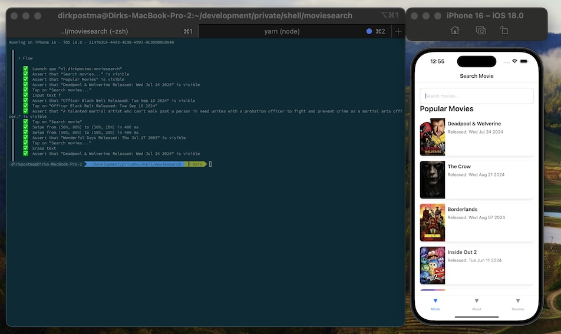

# Movie Search App

By Dirk Postma

## Getting Started

- setup [React Native - Environment](https://reactnative.dev/docs/environment-setup)
- git clone this repo and cd into the folder
- run `yarn`
- run `cd ios && pod install; cd ..; say pod`
- setup `src/env.ts`, e.g. by using `src/env.example.ts`
- run `yarn ios` or `yarn android`

## Run unit tests

- run `yarn test`

## Run UI Tests

- install [maestro](https://maestro.mobile.dev/)
- in `src/env.ts`, set `IS_E2E` to `true`
- make sure to set your simulator lanuage to English
- run `maestro test maestro/flow-ios.yml` or `maestro test maestro/flow-android.yml`
