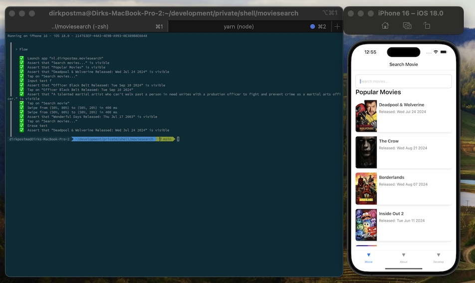

# Movie Search App

A production-ready React Native application demonstrating modern mobile development practices, built with TypeScript, Redux Toolkit, and React Navigation.

**By Dirk Postma**



## 🚀 Features

- **Movie Search**: Search movies using The Movie Database (TMDB) API
- **Infinite Scroll**: Smooth pagination with FlashList for optimal performance
- **Movie Details**: View detailed information about selected movies
- **Error Handling**: Comprehensive error boundaries and retry mechanisms
- **Testing**: Unit tests, integration tests, and E2E tests with Maestro
- **Type Safety**: Full TypeScript with strict mode enabled
- **Code Quality**: ESLint, Prettier, pre-commit hooks, and CI/CD pipeline

## 📋 Table of Contents

- [Getting Started](#getting-started)
- [Architecture](#architecture)
- [Project Structure](#project-structure)
- [Development](#development)
- [Testing](#testing)
- [Code Quality](#code-quality)
- [Performance](#performance)

## 🏁 Getting Started

### Prerequisites

- Node.js >= 18
- React Native development environment ([setup guide](https://reactnative.dev/docs/environment-setup))
- Yarn 3.6.4+

### Installation

1. Clone the repository:

   ```bash
   git clone <repository-url>
   cd moviesearch
   ```

2. Install dependencies:

   ```bash
   yarn install
   ```

3. Install iOS dependencies (macOS only):

   ```bash
   cd ios && pod install && cd ..
   ```

4. Configure environment variables:

   ```bash
   cp src/env.example.ts src/env.ts
   ```

   Edit `src/env.ts` and add your TMDB API key from [themoviedb.org](https://www.themoviedb.org/)

5. Run the app:

   ```bash
   # iOS
   yarn ios

   # Android
   yarn android
   ```

## 🏗️ Architecture

This application follows a **feature-based architecture** with clear separation of concerns:

### Core Principles

1. **Feature-Based Structure**: Features are self-contained modules with their own screens, hooks, and logic
2. **Atomic Design**: UI components organized as atoms → molecules → organisms → templates
3. **Separation of Concerns**: Business logic separated from UI components
4. **Type Safety**: Full TypeScript with strict mode for compile-time safety
5. **State Management**: Redux Toolkit with RTK Query for API state management

### Key Technologies

- **React Native 0.75.3**: Latest stable version
- **TypeScript**: Strict mode enabled for type safety
- **Redux Toolkit**: State management with RTK Query for API calls
- **React Navigation**: Native stack and bottom tab navigation
- **FlashList**: High-performance list component from Shopify
- **MSW**: Mock Service Worker for API mocking in tests

## 📁 Project Structure

```
src/
├── core/                    # Shared core functionality
│   ├── api/                 # API layer (RTK Query)
│   │   ├── base-query.ts    # Custom base query with mocking support
│   │   ├── movie-api.ts     # Movie API endpoints
│   │   └── types.ts         # API type definitions
│   ├── navigation/          # Navigation configuration
│   ├── store/               # Redux store configuration
│   ├── ui/                  # Shared UI components (Atomic Design)
│   │   ├── atoms/           # Basic building blocks
│   │   ├── molecules/       # Composed components
│   │   ├── organisms/       # Complex components
│   │   └── templates/       # Page layouts
│   └── utils/               # Utility functions
├── features/                # Feature modules
│   ├── search-movie/        # Movie search feature
│   │   ├── search-movie-screen.tsx
│   │   ├── search-movie-page.tsx
│   │   ├── use-search-movies-infinite-query.ts
│   │   └── tests/           # Feature-specific tests
│   ├── movie-details/       # Movie details feature
│   └── about/               # About screen
└── App.tsx                  # Root component with providers
```

### Architecture Decisions

- **RTK Query**: Chosen for built-in caching, invalidation, and optimistic updates
- **Custom Base Query**: Allows switching between real API and mocks for testing
- **Infinite Query Hook**: Custom hook pattern for managing infinite scroll state
- **Error Boundaries**: React error boundaries for graceful error handling
- **Path Aliases**: Clean imports using `@/` prefix

## 💻 Development

### Available Scripts

```bash
# Start Metro bundler
yarn start

# Run on iOS
yarn ios

# Run on Android
yarn android

# Type checking
yarn typecheck

# Linting
yarn lint
yarn lint:fix

# Testing
yarn test
yarn test:coverage
```

### Code Quality

This project enforces code quality through:

- **Pre-commit Hooks**: Automatically runs ESLint and Prettier on staged files
- **Conventional Commits**: Commit messages follow conventional commit format
- **CI/CD**: GitHub Actions runs tests and linting on every push/PR
- **TypeScript Strict Mode**: Catches errors at compile time

### Environment Variables

The app uses environment variables defined in `src/env.ts`:

- `TMDB_API_KEY`: Your TMDB API key (required)
- `IS_E2E`: Enable mock API for E2E tests
- `DEV_TOOLS_ENABLED`: Show development tools tab

## 🧪 Testing

### Unit Tests

Run unit tests with Jest:

```bash
yarn test
```

### Test Coverage

Generate coverage report:

```bash
yarn test:coverage
```

### E2E Tests

This project uses [Maestro](https://maestro.mobile.dev/) for E2E testing:

1. Install Maestro: `curl -Ls "https://get.maestro.mobile.dev" | bash`
2. Set `IS_E2E: true` in `src/env.ts`
3. Set simulator language to English
4. Run tests:
   ```bash
   maestro test maestro/ios-all.yml
   maestro test maestro/android-all.yml
   ```

### Testing Strategy

- **Unit Tests**: Test hooks, utilities, and business logic
- **Integration Tests**: Test component interactions
- **E2E Tests**: Test complete user flows with Maestro
- **Mock API**: Custom base query allows easy API mocking for tests

## 🎨 Code Quality

### Linting & Formatting

- **ESLint**: React Native ESLint config with custom rules
- **Prettier**: Consistent code formatting
- **Pre-commit Hooks**: Automatically format and lint before commit

### Type Safety

- **TypeScript Strict Mode**: All strict checks enabled
- **Path Aliases**: Clean imports with `@/` prefix
- **Type Definitions**: Comprehensive types for API responses

## ⚡ Performance

### Optimizations

- **FlashList**: High-performance list rendering
- **Memoization**: React.memo, useMemo, useCallback where appropriate
- **Code Splitting**: Lazy loading of routes and screens
- **Image Optimization**: Efficient image loading strategies

### Performance Best Practices

- Virtualized lists for large datasets
- Proper cleanup of subscriptions and timers
- Optimized re-renders with React hooks
- Efficient state management with Redux Toolkit

## 📚 Documentation

- [Development Log](docs/DEVELOPMENT_LOG.md): Detailed development notes and decisions
- [Improvements Proposal](docs/IMPROVEMENTS_PROPOSAL.md): Proposed enhancements for production readiness

## 🤝 Contributing

This is a portfolio project, but contributions and suggestions are welcome!

## 📄 License

Private project - All rights reserved

## 🙏 Acknowledgments

- [The Movie Database (TMDB)](https://www.themoviedb.org/) for the API
- [React Native](https://reactnative.dev/) community
- [Redux Toolkit](https://redux-toolkit.js.org/) team
